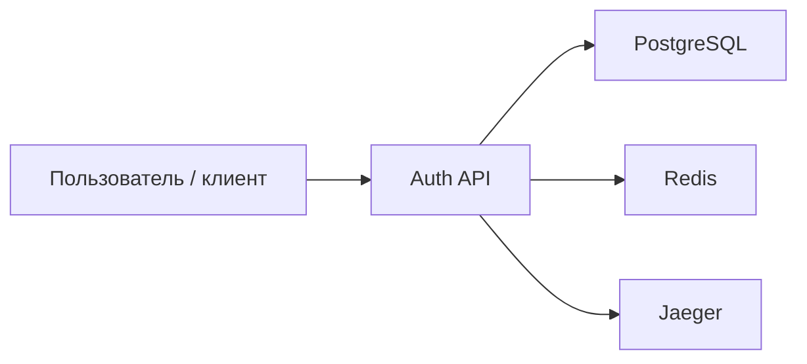
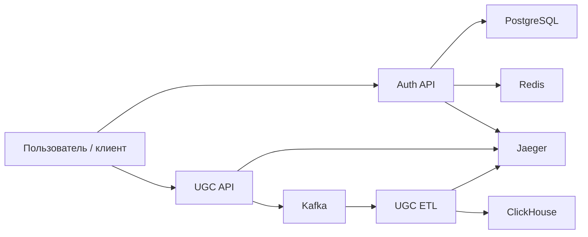

# Архитектура сервиса (C4 Level 2, упрощённо)
 
## Current
 

 
### Описание current
Текущая архитектура до добавления UGC-сервисов включает:
- `auth` как основной backend-сервис;
- `PostgreSQL` для хранения данных авторизации;
- `Redis` для кеширования и служебных данных;
- `Jaeger` для трассировки запросов.
 
## Future (TODO / Sprint 8)
 

 
### Описание future
После реализации Sprint 8 архитектура расширяется:
- `ugc_api` принимает пользовательские действия;
- `ugc_api` публикует сообщения в `Kafka`;
- `ugc_etl` непрерывно читает события из `Kafka`;
- `ugc_etl` сохраняет события просмотров в `ClickHouse`;
- `Jaeger` используется для трассировки сервисных вызовов;
- аналитики работают с `ClickHouse`, а не с транзакционной базой.
 
## Границы ответственности
- `Auth API` — авторизация, токены, OAuth, работа с пользователями.
- `UGC API` — приём пользовательских событий и валидация запроса.
- `Kafka` — буфер и брокер событий между API и ETL.
- `UGC ETL` — перенос событий просмотров в аналитическое хранилище.
- `ClickHouse` — аналитическое хранилище для запросов по просмотрам.

